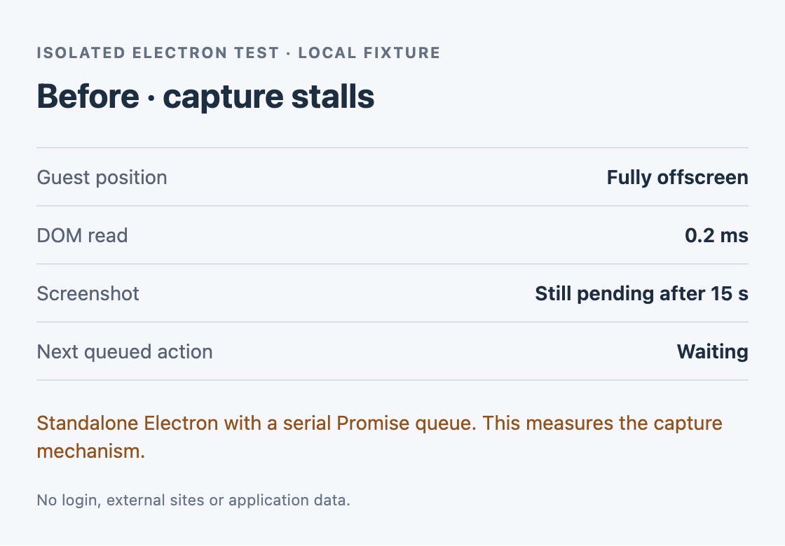
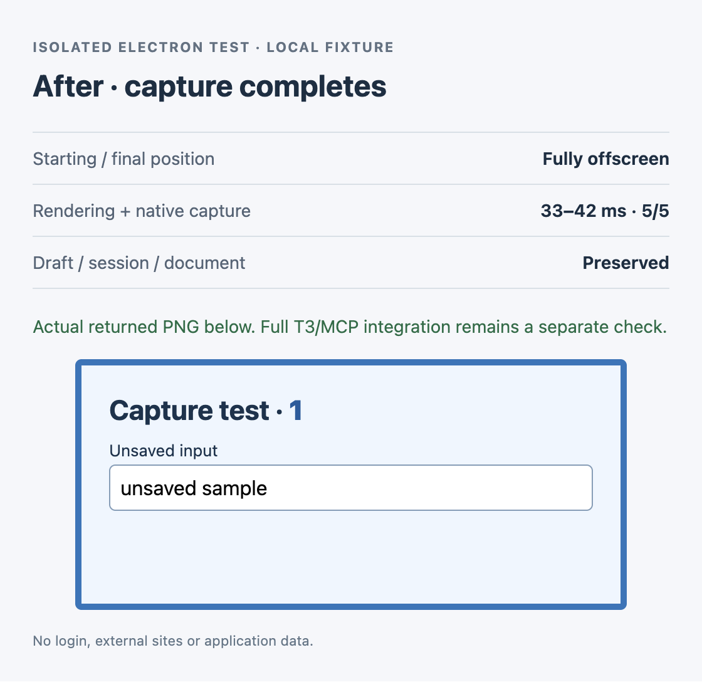

# Background screenshot reproduction

[Full-app MCP verification of the proposed fix](integration/README.md) — 20/20 captures, including hidden and minimized windows. The original experiment below remains unchanged.

[Two-frame versus adaptive comparison](frame-comparison/README.md) — 192 fresh native component captures; no demonstrated need for an adaptive loop.

Synthetic Electron demonstration of the capture mechanism in [T3 Code #16567](https://github.com/pingdotgg/t3code/issues/16567).

```sh
npm ci
env -u ELECTRON_RUN_AS_NODE npm start
```

Run on a macOS desktop with Node.js installed. The demo takes about 16 seconds, writes `evidence/`, and exits. It uses local HTML and a new disposable profile; no login or external site is involved. Package installation downloads Electron.

## What it does

1. Captures a paintable `<webview>` as a control, then moves it to `(-100000, -100000)` with background throttling disabled.
2. Changes a counter and an unsaved input. Reads the DOM, requests `Page.captureScreenshot`, and places another action behind that promise.
3. Observes the capture for 15 seconds. Moves the guest back inside the window to release the stalled request.
4. Runs five captures from the offscreen starting state: temporarily render the guest behind the test UI, wait two host animation frames, capture natively with an 8-second deadline, then restore its offscreen position.

## Recorded result

macOS arm64, Electron 44.4.2 / Chromium 152.0.7977.130:

- DOM read: **0.2 ms**; offscreen CDP capture: **still pending after 15 s**; next queued action: **waiting**.
- Temporary rendering + native capture: **5/5 in 33–42 ms**, including placement and restoration.
- Unsaved input, sessionStorage and document time origin were unchanged. The returned PNG visibly contains the updated counter (`1`) and input (`unsaved sample`).

These are screenshots of the demo's live status window. The after image embeds the actual returned PNG; the before case produced no PNG during the observation period.




[Measured results](evidence/results.json) · [Returned fixture PNG](evidence/captured-fixture.png)

## Scope

This isolates the Electron capture mechanism. The queue is a plain Promise chain; the demo does not import T3's broker or validate a full provider/MCP traversal. It is an experimental mechanism check, not a complete production patch. Other operating systems, minimized/locked windows and non-default zoom were not tested. Timings will vary.

Created and checked by Codex on behalf of Derek King.
