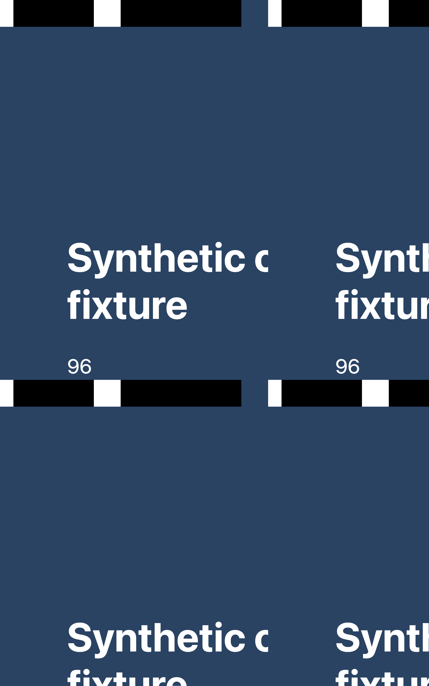
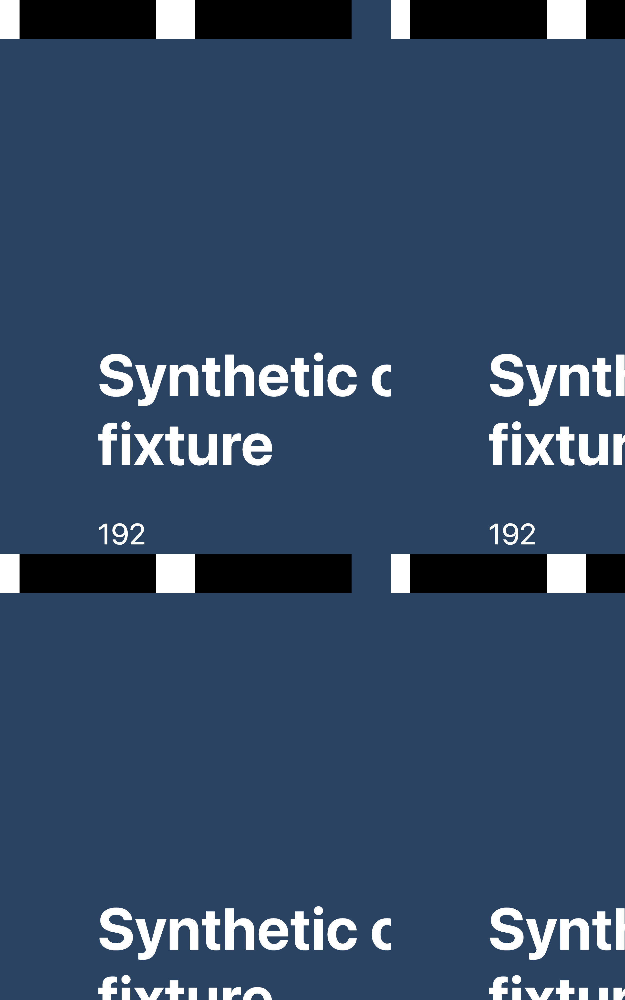

# Two-frame versus adaptive native warm-up

> [!NOTE]
> Codex responding on behalf of Derek King.

**Both approaches returned 96/96 fresh screenshots.** The current implementation requested 192 native frames; the adaptive experiment requested 385. This matrix found no case requiring a third native request, so it does not justify changing the production limit. It does not prove that two requests suffice on every system.

| Approach | Fresh captures | Native requests per capture | Total native requests | Capture time, median (range) |
| --- | --- | --- | --- | --- |
| Current, at most two requests | 96/96 | 2 | 192 | 71.5 ms (37.8–219.5) |
| Sequential adaptive experiment | 96/96 | 3–5 | 385 | 81.0 ms (46.4–225.1) |

These timings are descriptive, not a randomized performance benchmark. More adaptive calls alone do not show that they were necessary: CDP can settle after the last required paint.

## What was compared

The real `DesktopBrowserHost` and `CdpRelay` from PR #17298 at `7aaff447496ef8fdc3889dde9801ec3db8417754` ran against actual Electron guests and native/CDP APIs. The [experimental patch](adaptive-experiment.patch) changes only the warm-up block to request native frames sequentially until CDP settles, the copy is empty, an API fails, the guest changes, or cancellation occurs. It retains the existing deadline and pending-work guard. This tests the adaptive idea from [#13600](https://github.com/pingdotgg/t3code/pull/13600) in the current host, not that PR's older snapshot implementation.

Each implementation ran the Cartesian product of:

- Window visible, covered by another window, hidden, or fully minimized.
- Guest 1280×800 or 800×1280.
- Zoom 0.8 or 1.25.
- CDP clip scale 0.5, 1, or 2.
- DOM mutation or cache-bypassing reload before capture.

Every capture began and ended with the guest at `(-100000, -100000)`. Returned PNGs contained the newly assigned binary marker. An independent Python PNG decoder checked all 192 markers without Electron's image decoder. Unsaved input, session storage, document time origin, marker DOM state, and scroll state were unchanged across each individual capture; capture/release counts balanced, and hidden/minimized windows stayed so. The fixture's scroll position was zero; this was not a nonzero-scroll or viewport-geometry correctness test.

[Raw measurements](results.json) · [Independent verification summary](verification.json) · [Synthetic fixture](fixture.html) · [Runner template](run.template.ts)




## Scope

macOS 15.7.4 arm64, Electron 44.4.2, Chromium 152.0.7977.130, one unchanged display setup. This is a native component comparison: the harness implements renderer placement/acknowledgement and throttling adapters. It is **not** another full-app/MCP traversal; that earlier evidence is [separate](../integration/README.md). No installed T3 app, real login, external site, or user profile was involved.

This run does not cover Windows/Linux, locked displays, other Spaces, different display DPRs, live PiP/recording overlap, or simultaneous screenshots. All 192 PNGs were retained locally; this repository includes two representatives. Initial fixture-calibration runs and a harness shutdown between modes are excluded from this completed matrix. The current implementation ran first, then the adaptive variant, with a new window/guest for each.

## Repeat

Use a separate checkout at the source commit above, with its dependencies already installed. `prepare.mjs` only reads it and creates a new experiment directory; it refuses to overwrite an existing one.

```sh
node prepare.mjs /path/to/t3code
cd prepared
/path/to/t3code/node_modules/.bin/vp pack
env -u ELECTRON_RUN_AS_NODE /path/to/t3code/apps/desktop/node_modules/electron/dist/Electron.app/Contents/MacOS/Electron build/run.cjs
```

Run on an unlocked macOS desktop. It opens only synthetic windows, uses a disposable profile, writes `results/`, and exits. The runner asserts pixel freshness and preserved state for every capture. The PNG markers are 16 bits, least-significant bit first, following a white/black calibration pair along the top. On a screenshot error, the harness also attempts one diagnostic rescue copy after the deadline; no rescue was needed in the reported matrix.
