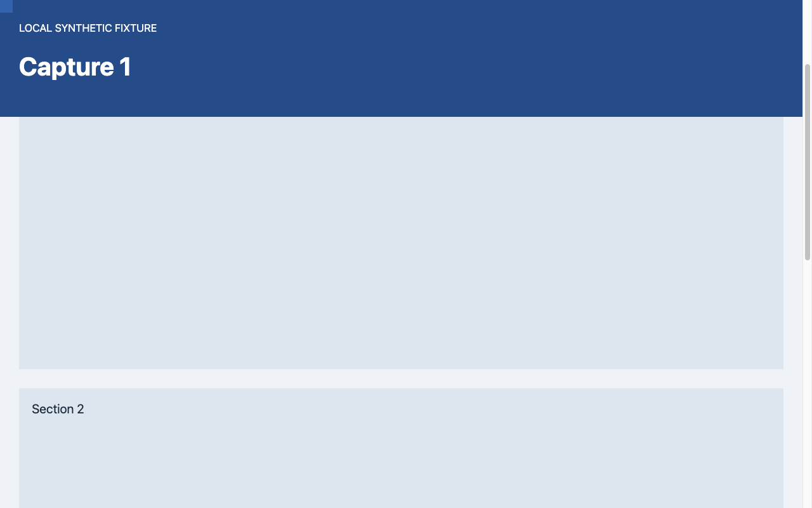
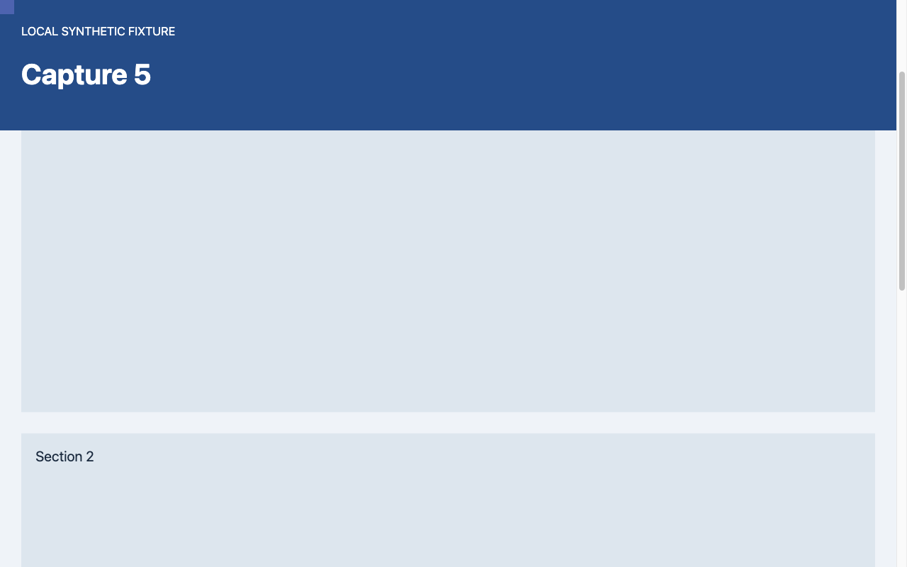

# Full app capture verification

> [!NOTE]
> Codex responding on behalf of Derek King.

The proposed fix was tested through T3's actual MCP snapshot path on macOS 15.7.4 arm64, Electron 44.4.2. All content was a local synthetic HTML fixture.

| Control / window state | Result |
| --- | --- |
| Original CDP forwarding, guest fully offscreen | Snapshot timed out at 15,050 ms; the following status call reported no automation host. |
| Fixed; app visible | 5/5, 54–93 ms |
| Fixed; app covered by a separate window | 5/5, 60–68 ms |
| Fixed; app hidden | 5/5, 44–65 ms |
| Fixed; app fully minimized | 5/5, 57–73 ms |

Every fixed capture started and ended with the guest at `(-100000, -100000)`. Session storage, unsaved input, document time origin, and scroll position stayed unchanged. Each successful capture was followed by a successful MCP status call. Capture/release events balanced after every request. Returned PNGs were 1280 × 800, and independent pixel checks distinguished all five changing markers in every case.

[Raw measurements](results.json) · [Fixture](fixture.html) · [Standalone minimal reproduction](../README.md)

## What ran

`callAcpMcpTool → authenticated MCP HTTP → snapshot handler → broker → ServerBrowser → SessionControl → ServerBrowserPage → Playwright → desktop fd channel → DesktopBrowserHost → production renderer/preload → CDP screenshot with native frame requests`.

The full app was built from upstream `805967a878e6804d58c151f29d2a3d0a06828fd1` plus the proposed patch, with a separate Electron profile and server database. Three test-only hooks in the built server exposed normal thread creation, credential issuance, and initial browser opening through a private Unix socket. Capture code and MCP handlers were not replaced. No model/provider turn was started.

For the control, the same build forwarded `Page.captureScreenshot` directly to the guest debugger, as upstream does. The rendering/capture interceptor was disabled; the screenshot timed out and the broker lost its host. This was a controlled comparison, not a second checkout of an unmodified release.

To repeat manually with an active T3 agent: serve the fixture over loopback, open its thread in the desktop, use `preview_open` with `open=false`, then alternate changing its marker/input via `preview_evaluate` and calling `preview_snapshot`. Check the returned pixels and page state, then repeat with the app hidden/minimized. Ensure the server is attached to the desktop guest: a headless page is a different test.

## Boundaries

Focused automated tests cover absent readiness acknowledgements, native/CDP stalls, synchronous failure, late results, detach/replacement/release, and recording/throttling overlap. The native APIs cannot be cancelled: timed-out underlying work retains one guest slot until it settles; retries do not accumulate more requests. Other browser commands can continue.

Windows, Linux, locked displays, and a zoom/DPR matrix were not tested. This does not claim to fix unrelated host selection, navigation queueing, viewport geometry, or every wake-lock report.
